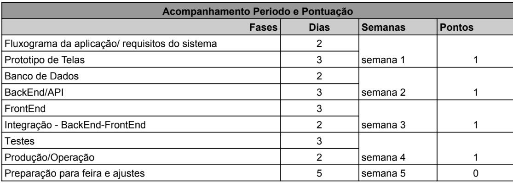
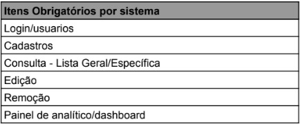

# 🖥️ Sistema Gestão de Munições

# 📕 Menu
<a href="./src/pages/escopo.md">
    <button>➡️ Escopo</button>
</a>
<a href="./src/pages/requisitos.md">
    <button>➡️ Requisitos</button>
</a>
<a href="./src/pages/fluxograma.md">
    <button>➡️ Fluxograma</button>
</a>
<a href="./src/pages/bancoDados.md">
    <button>➡️ Banco de Dados</button>
</a>

## 📅Cronograma

## Itens obrigatórios do sistema
