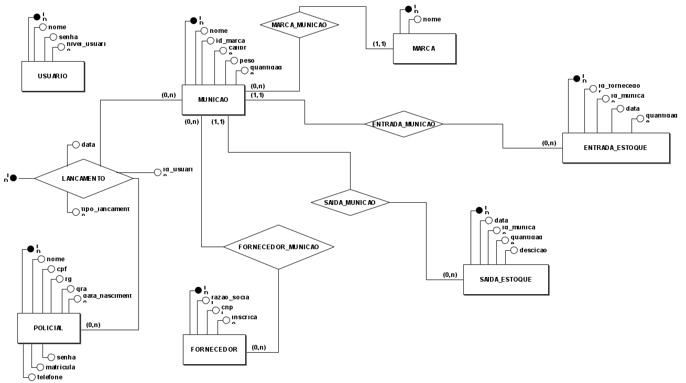

# 🖥️ Sistema Gestão de Munições

# 📕 Menu
<a href="../../Readme.md">
    <button>➡️ Home</button>
</a>
<a href="./escopo.md">
    <button>➡️ Escopo</button>
</a>
<a href="./requisitos.md">
    <button>➡️ Requisitos</button>
</a>
<a href="./fluxograma.md">
    <button>➡️ Fluxograma</button>
</a>
<a href="./documentacaoAPI.md">
    <button>➡️ Documentação API</button>
</a>

## Modelo Conceitual do Banco

## Modelo Lógico do Banco

