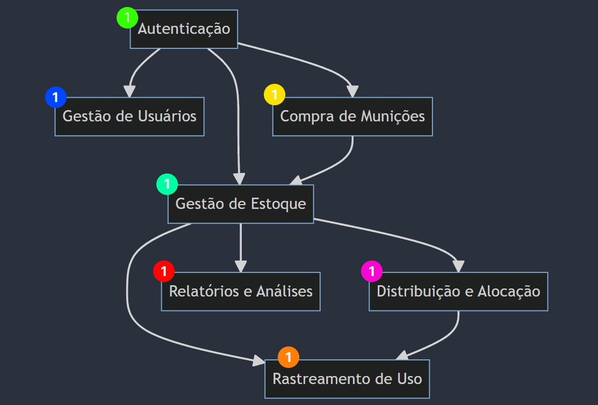
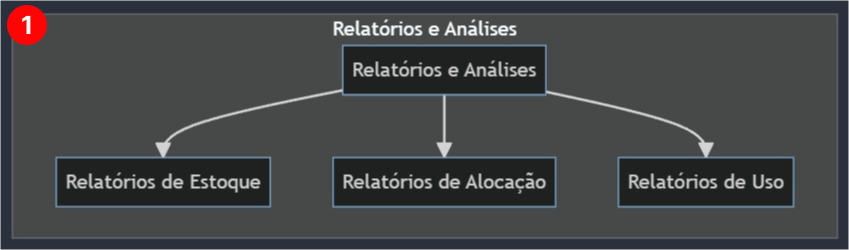
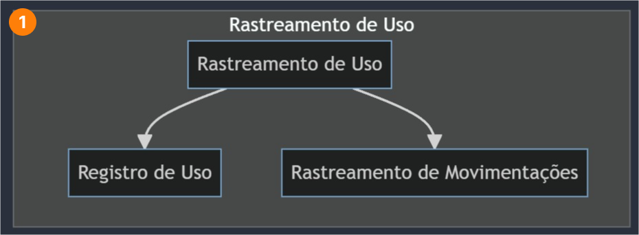
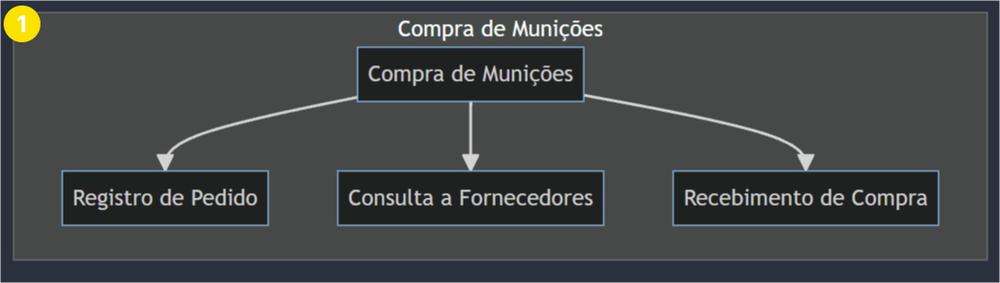
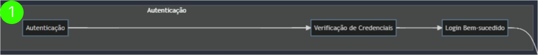
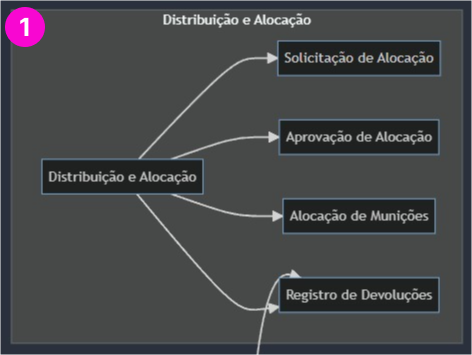
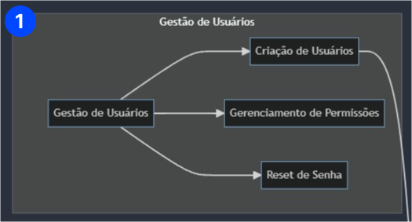
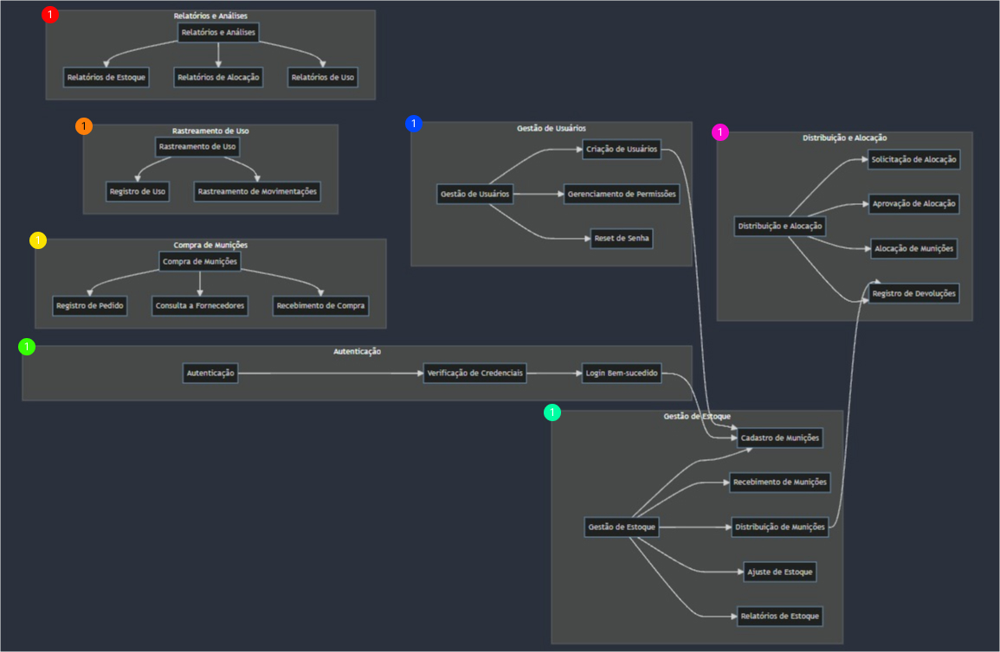

# 🖥️ Sistema Gestão de Munições

# 📕 Menu
<a href="../../Readme.md">
    <button>➡️ Home</button>
</a>
<a href="./escopo.md">
    <button>➡️ Escopo</button>
</a>
<a href="./requisitos.md">
    <button>➡️ Requisitos</button>
</a>

## Fluxograma Relatórios e Análises

## Fluxograma Rastreamento de Uso

## Fluxograma Compra de Munições

## Fluxograma Autenticação

## Fluxograma Gestão de Estoque

## Fluxograma Distribuição e Alocação

## Fluxograma Gestão de Usuários

## Fluxograma completo

